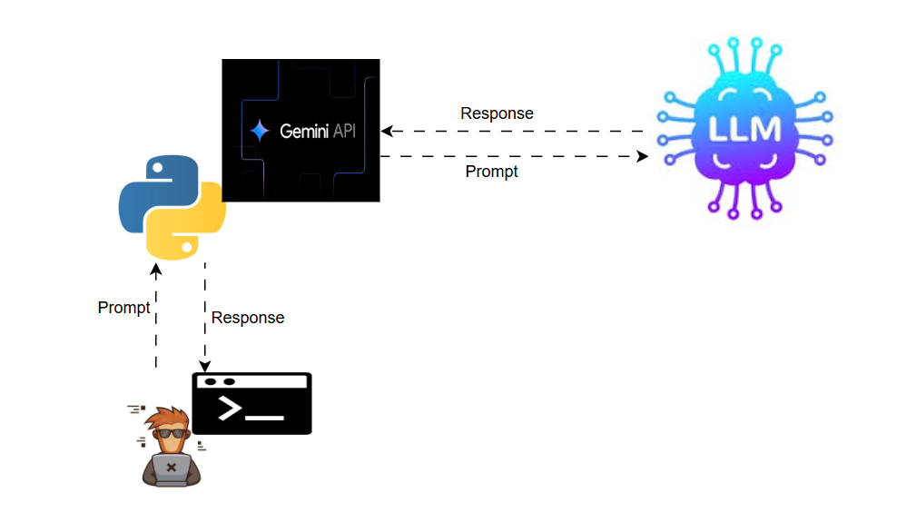

# 🚀 Gemini Dynamic Chat

**Architecture**


### Python CLI Chatbot using Google's Gemini API


A **Generative AI chatbot** built with **Python and Google's Gemini API** that runs directly from the command line.

This project demonstrates how to integrate a **Large Language Model (LLM)** into a Python application to create an **interactive conversational AI system**.

---

# 📌 Project Overview

This chatbot enables users to interact with **Google Gemini** directly from the terminal.

The application workflow:

1️⃣ Accepts **user input** as a prompt
2️⃣ Sends the prompt to the **Gemini API**
3️⃣ The **LLM processes the request**
4️⃣ Gemini generates an **AI response**
5️⃣ The response is displayed in the **terminal**

The conversation continues dynamically until the user exits.

---

# 🧠 Architecture Flow

```
User
 │
 ▼
Terminal Input
 │
 ▼
Python Application
 │
 │  API Request (Prompt)
 ▼
Gemini API
 │
 ▼
Gemini LLM
 │
 │  Generated Response
 ▼
Gemini API
 │
 ▼
Python Application
 │
 ▼
Terminal Output
```

---

# ⚙️ Tech Stack

| Technology       | Purpose                   |
| ---------------- | ------------------------- |
| 🐍 Python        | Core programming language |
| 🤖 Gemini API    | Large Language Model      |
| 🔐 python-dotenv | Secure API key management |

---

# 🔑 Environment Setup

Create a `.env` file in the root directory.

```
GOOGLE_API_KEY=your_api_key_here
```

You can generate your API key from **Google AI Studio**.

---

# 📦 Installation

### Clone the repository

```
git clone https://github.com/yourusername/gemini-chatbot.git
cd gemini-chatbot
```

# ▶️ Run the Application

```
python gemini.py
```

---

# 💬 Example Output

```
🚀 Gemini Dynamic Chat (Type 'bye' to quit)

you: Hello
Gemini: Hi! How can I help you today?

you: What is Kubernetes?
Gemini: Kubernetes is an open-source platform that automates deployment, scaling, and management of containerized applications.

you: bye
Gemini: Goodbye! Happy coding!
```

# 💡 Features

✅ Interactive command-line chatbot
✅ Dynamic conversation loop
✅ Secure API key management using `.env`
✅ Error handling for API requests
✅ Exit commands (`exit`, `quit`, `bye`)

---
# 📎 Repository

🔗 **GitHub Repo**
`https://github.com/manoj-406/GenAI-learning/tree/main/gemini`

---

# 👨‍💻 Author

**Manoj Gonchala**

DevOps | Cloud | Generative AI Enthusiast


